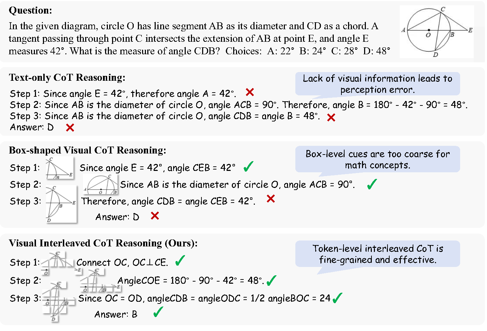
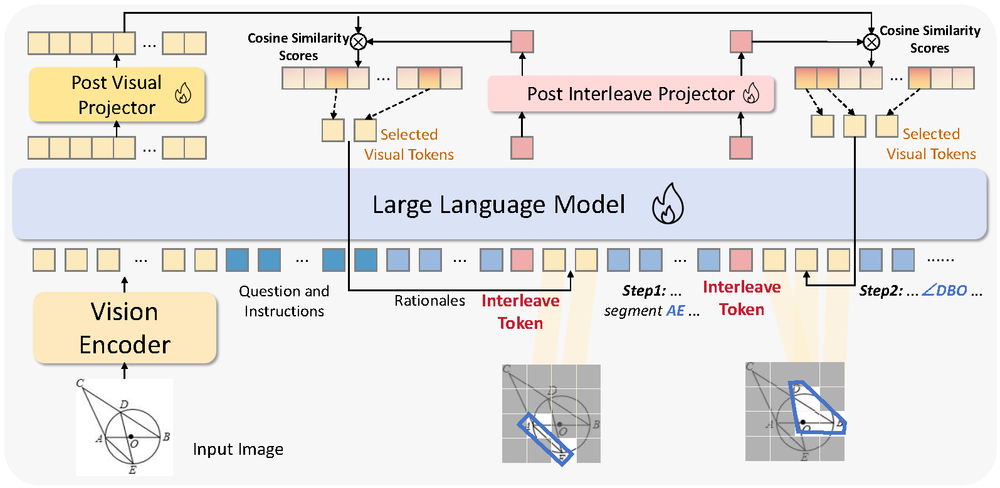
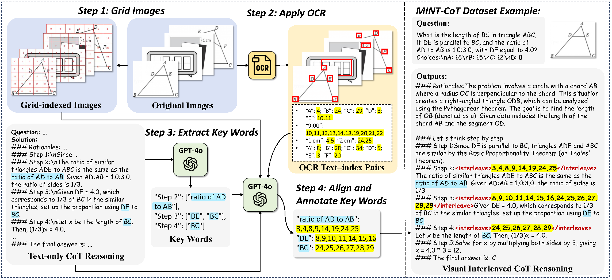

# **🔥MINT-CoT:** Enabling Interleaved Visual Tokens in Mathematical Chain-of-Thought Reasoning

Official repository for the paper "[MINT-CoT: Enabling Interleaved Visual Tokens in
Mathematical Chain-of-Thought Reasoning]()".

[[📖 Paper]()] [[🤗 Dataset](https://huggingface.co/datasets/xy06/MINT-CoT-Dataset)] [[🤗 Model](https://huggingface.co/xy06/MINT-CoT-7B)]

## 💥 News


## 👀 About MINT-CoT

Chain-of-Thought (CoT) has widely enhanced mathematical reasoning in Large Language Models (LLMs), but it still remains challenging for extending it to multi modal domains.  Existing works either adopt a similar textual reasoning for image input, or seek to interleave visual signals into mathematical CoT. However, they face three key limitations for math problem-solving: reliance on coarse-grained box-shaped image regions, limited perception of vision encoders on math content, and dependence on external capabilities for visual modification. 

<p align="center">
     <br>
</p>


In this project, we propose **MINT-CoT**, introducing **M**athematical **IN**terleaved **T**okens for **C**hain-**o**f-**T**hought visual reasoning.  MINT-CoT adaptively interleaves relevant visual tokens into textual reasoning steps via an Interleave Token, which dynamically selects visual regions of any shapes within math figures.

<p align="center">
     <br>
</p


To empower this capability, we construct the MINT-CoT dataset, containing 54K mathematical problems aligning each reasoning step with visual regions at the token level, accompanied by a rigorous data generation pipeline.

<p align="center">
     <br>
</p>


We further present a three-stage MINT-CoT training strategy, progressively combining text-only CoT SFT, interleaved CoT SFT, and interleaved CoT RL, which derives our MINT-CoT-7B model. 


## 💪 Get Started

### Installation

Clone the repository:

```
git clone https://github.com/xinyan-cxy/MINT-CoT.git
cd MINT-CoT
```

Create a conda environment:

```
conda create -n mint python=3.11
conda activate mint
```

Please follow the official instructions [here](https://pytorch.org/get-started/locally/) to install both PyTorch and TorchVision dependencies.

Install additional dependencies:

```
bash src/setup.sh
```


### Dataset Preparation

Download our [dataset](https://huggingface.co/datasets/xy06/MINT-CoT-Dataset) and unzip `images.zip`:

```bash
huggingface-cli repo download xy06/MINT-CoT-Dataset --local-dir ./data
unzip ./data/images.zip -d ./data/
```


### 🚀 Training

#### Stage 1: Text-only CoT SFT.

```bash
DISABLE_VERSION_CHECK=1 llamafactory-cli train src/train/qwen2vl_7b_full_sft_text_only.yaml
```

#### Stage 2: Interleaved CoT SFT.

```bash
DISABLE_VERSION_CHECK=1 llamafactory-cli train src/train/qwen2vl_7b_full_sft_interleaved.yaml
```

#### Stage 3: Interleaved CoT RL.

```bash
bash run_grpo_qwen2vl_interleaved.sh
```


### 💫 Evaluation

We use [VLMEvalKit](https://github.com/open-compass/VLMEvalKit) to evaluate the MINT-CoT models on different benchmarks. We provide the evaluation instructions and key code here.

First, you need to install VLMEvalKit according to the [official instructions](https://github.com/open-compass/VLMEvalKit/blob/main/docs/en/Quickstart.md).

Next, replace the `model.py` and `prompt.py` files in `VLMEvalKit-main/vlmeval/vlm/qwen2_vl/` with the files we provide [here](https://github.com/xinyan-cxy/MINT-CoT/tree/main/evaluation).

Finally, you can use the following command to perform the evaluation.

```bash
CUDA_VISIBLE_DEVICES=0 python run.py --data MathVista_MINI --model Qwen2-VL-7B-Instruct --verbose
```


### 🥳 Acknowledgements

We would like to thank [R1-V](https://github.com/Deep-Agent/R1-V), [LLaMA-Factory](https://github.com/hiyouga/LLaMA-Factory) and [Mulberry](https://github.com/HJYao00/Mulberry), upon which our repo is built.

